# Group-Office feature

Group-Office has a modern user interface with an attractive feture list. Group-Office is a PHP based dual license commercial/open source groupware and CRM and DMS product developed by the Dutch company Intermesh. The open source version, Group-Office Community, is licensed under the AGPL, and is available via SourceForge. 

### Feature list

#### Notes
The notes module is a simple note taking modules. The notes module supports:

<li>Links</li>
Group-Office has a very powerful link function. Each item can be linked to another. The link function gives you the ability to organize your data easily. You can for example link:

<li>Sharing</li>

Notes can be shared among groups.

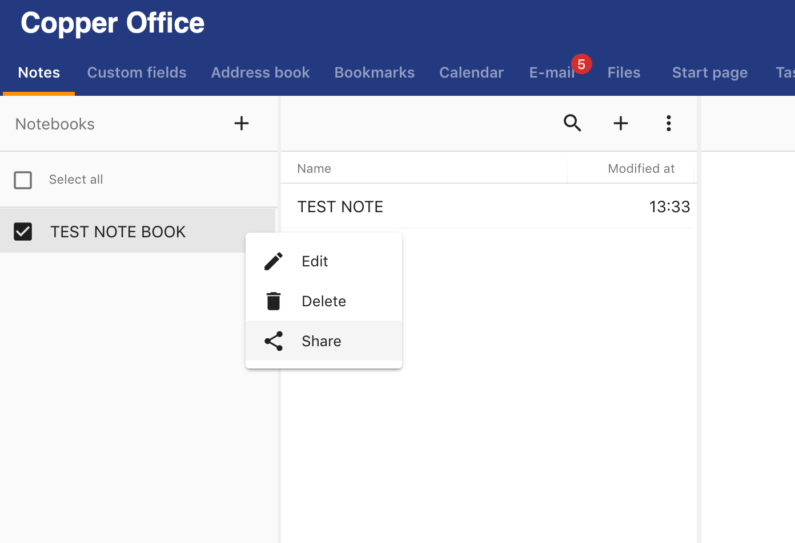

<li>Attaching Files </li>

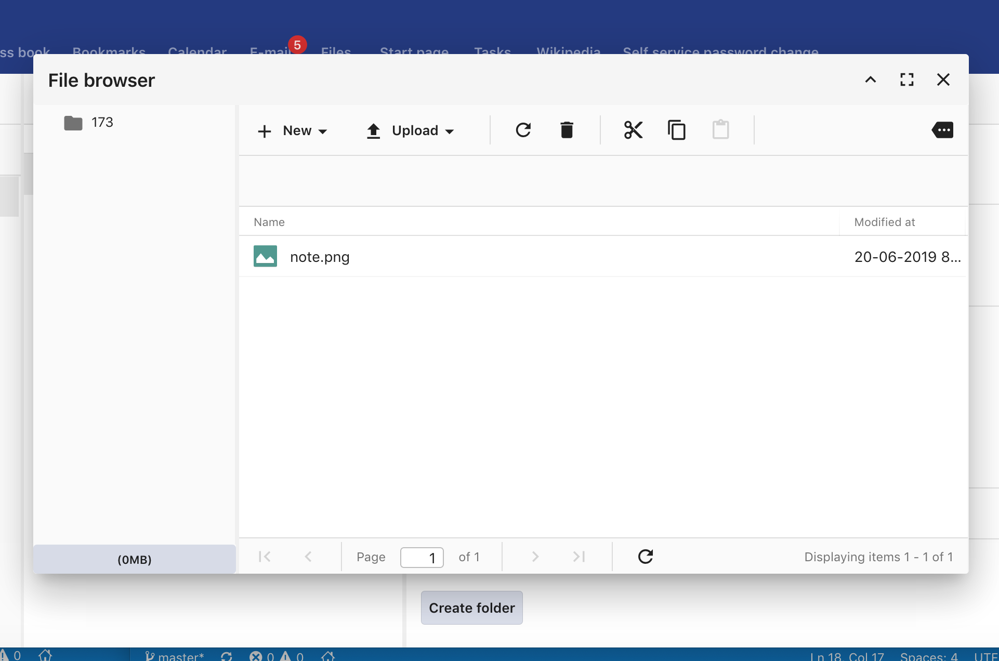

<li>You can manage several notebooks according to your needs. </li>

#### Address book

The address book is a very powerful tool to manage contacts and organizations. It’s easy to share address books with other users.

The address book module supports:

<li> Can link with tasks, calendar events, contacts etc… </li>

<li> Can directly send an email from contact </li>

<li> Can maintain several address books </li>

<li> Export contacts </li>

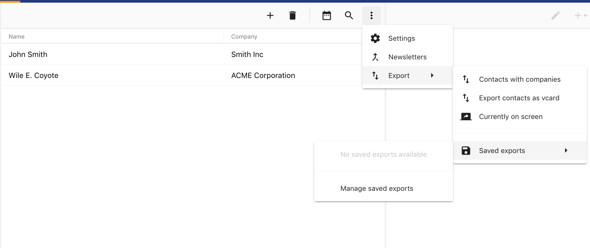

#### Bookmark

<li> Can maintain a section of URL bookmarks for save and use (anywhere) important sites. </li>

#### Calendar

<li> Send notification mails to participants when events create in calendar </li>

<li> Accepting from mail</li>

Once accepted it can be seen in the event.

<li> Send Events to external users </li>

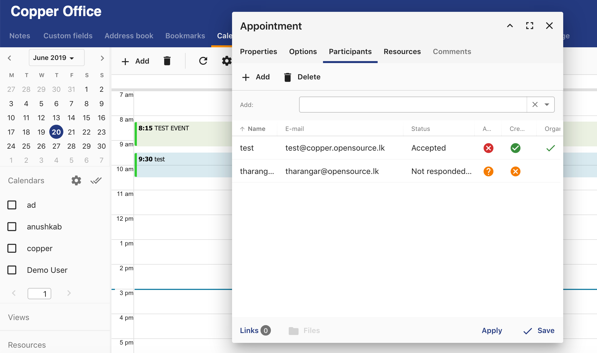

<li> Allocate a location </li>

<li> Can send a recurrence notification </li>

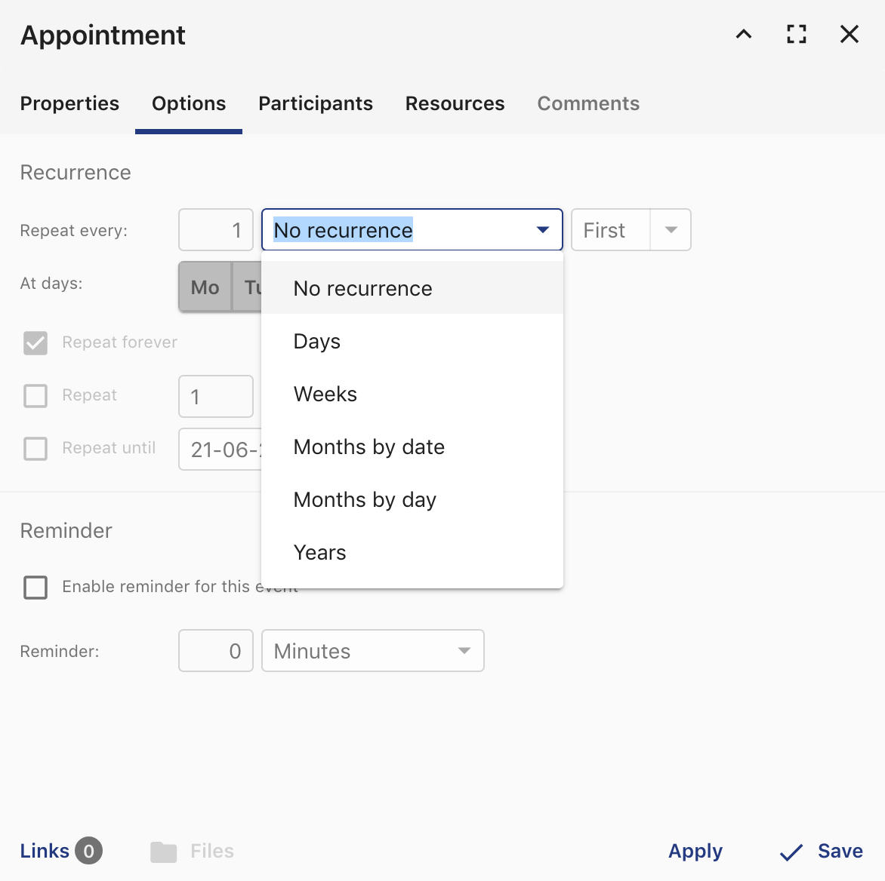

<li> Can check resource availability through calendar </li>

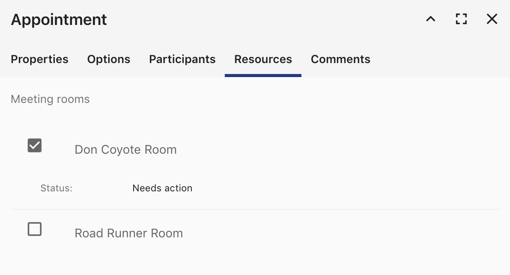

<li> Can categorize calendar e.g. Dev Calendar, Events Calendar </li>

<li> Enabling reminders </li>

#### File storage
<li> Upload file </li>

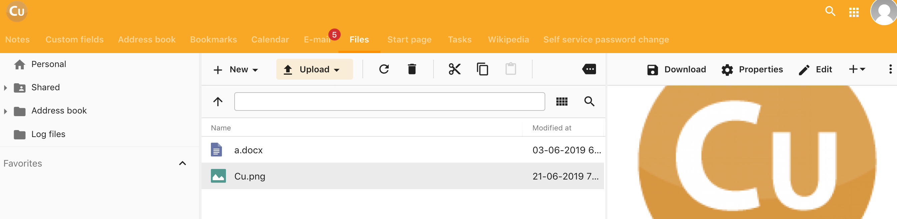

<li> Send Download Link through email</li>

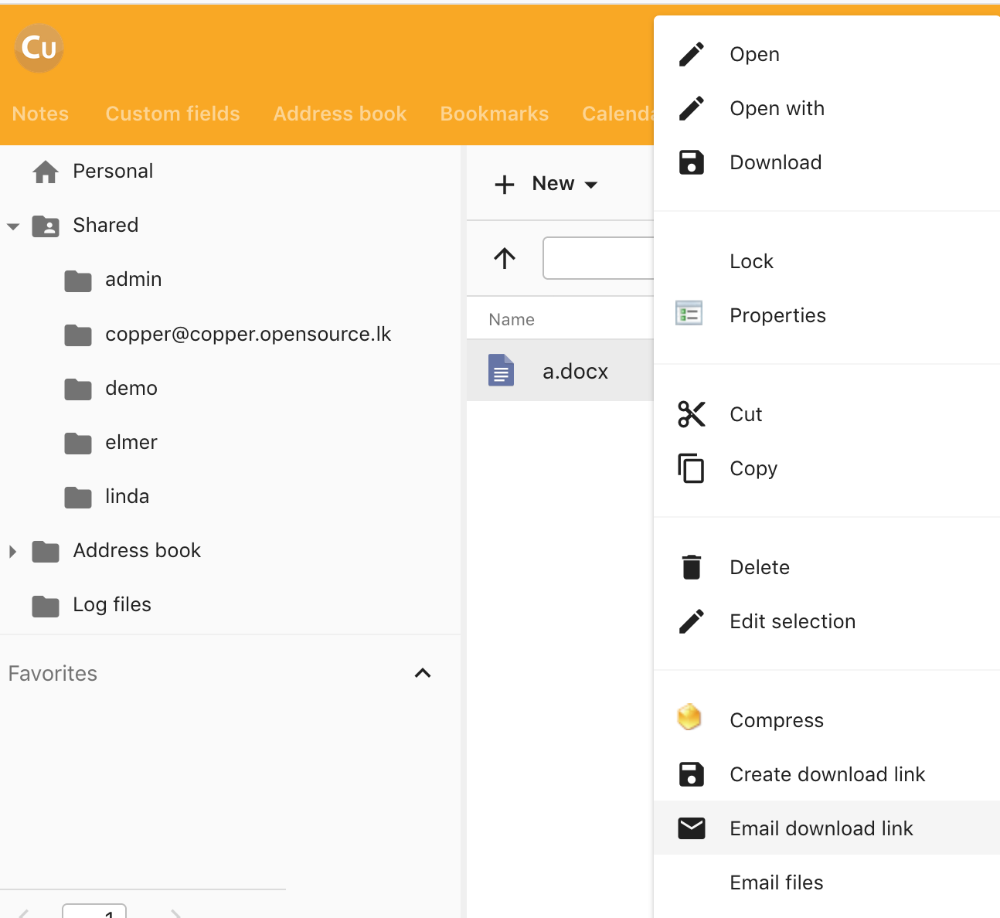

<li> Can have an expiration date </li>

<li> Creating new Microsoft word and Open office documentation files</li>

<li> Editing can be done only after download </li>

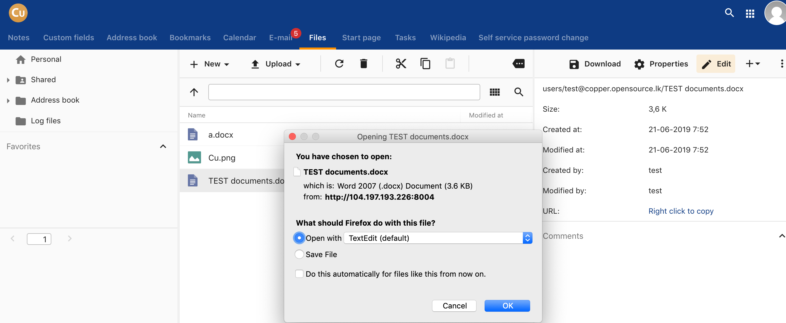

<li> Can link with tasks, calendar events, contacts etc… </li>

#### Tasks

<li> Allocate Tasks to copper user </li>

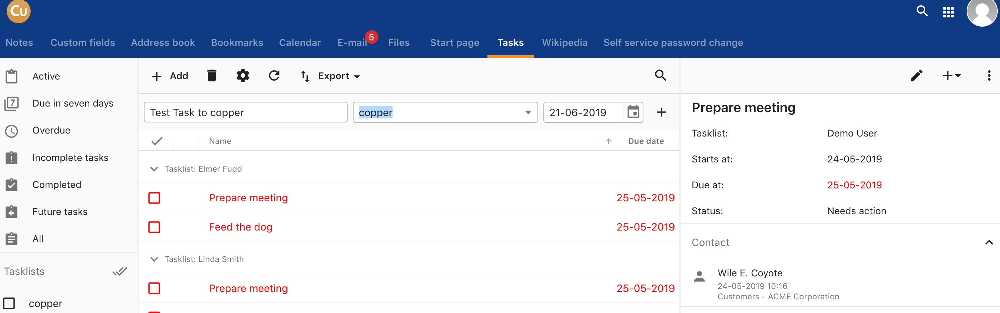

<li> Receive Allocated Tasks to copper user</li>

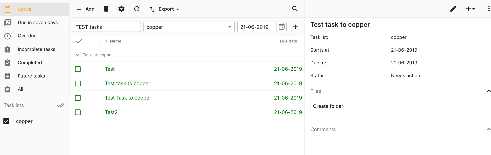

<li> Can link with tasks, calendar events, contacts etc… </li>

<li> Can recurrence notification </li>

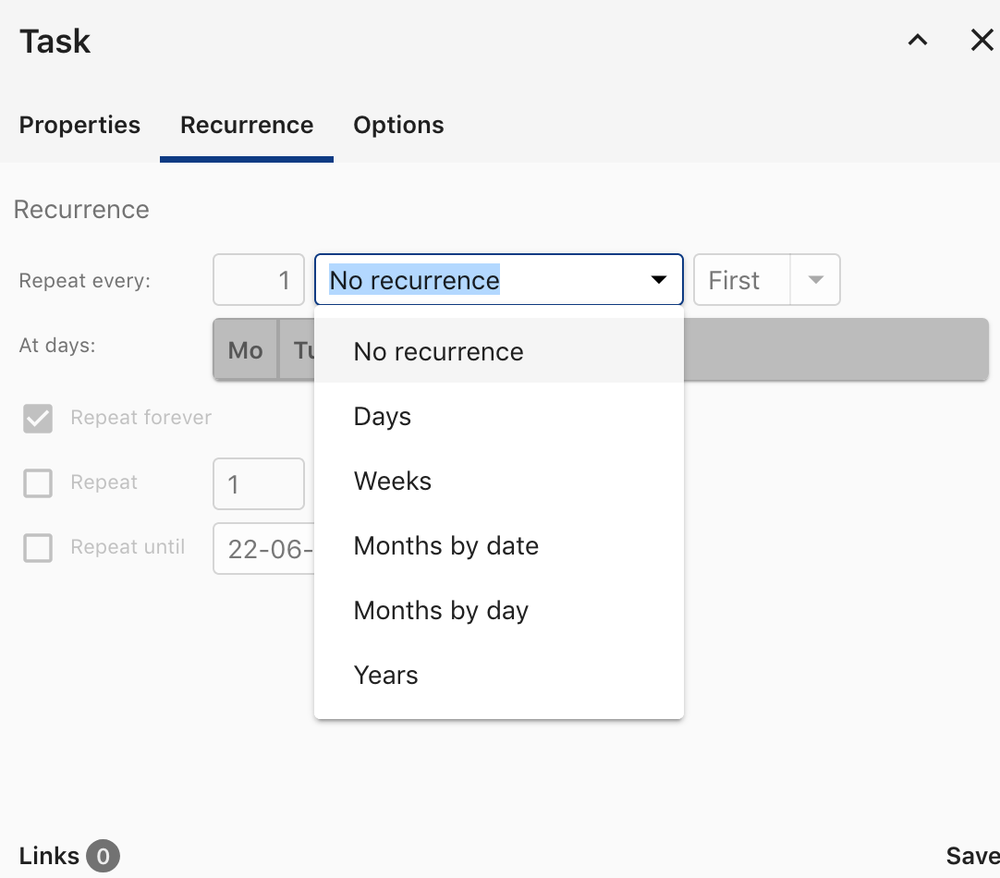

<li> Add Reminders </li>
You may add Reminders with time

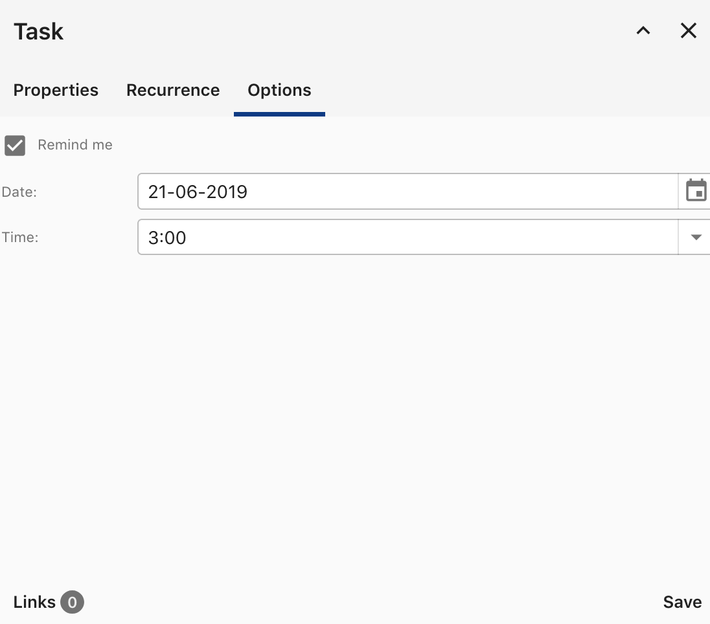

<li> Can export </li>
Exports available with many formats like, csv, pdf, html etc.

#### Start page

<li> You can customize your own page with most relevant functionalities you want. </li>

